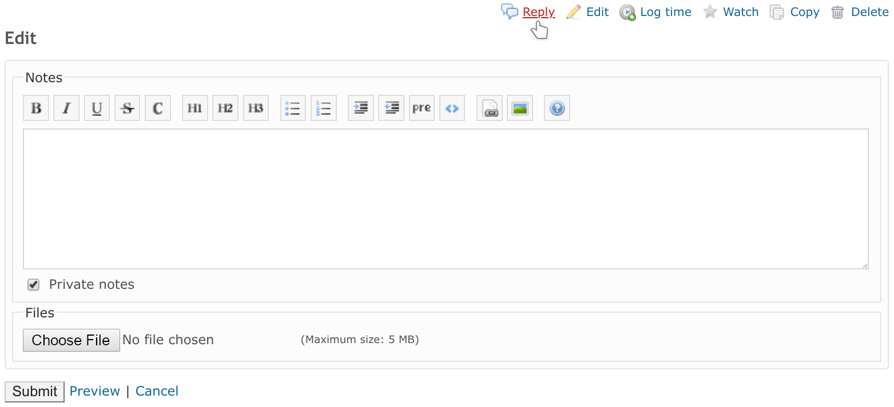

# That Issue Reply Button Plugin

This Redmine plugin adds a "Reply" button to the action menu of the issue page.
Unlike the native "Edit" button this button opens the issue edit form with notes form
(and attachments) only (i.e., without issue attributes and spent time form).

## Installation

- Move `that_issue_reply_button` directory to the `plugins` directory of Redmine
- Restart Redmine

## License

GNU General Public License (GPL) v2.0
